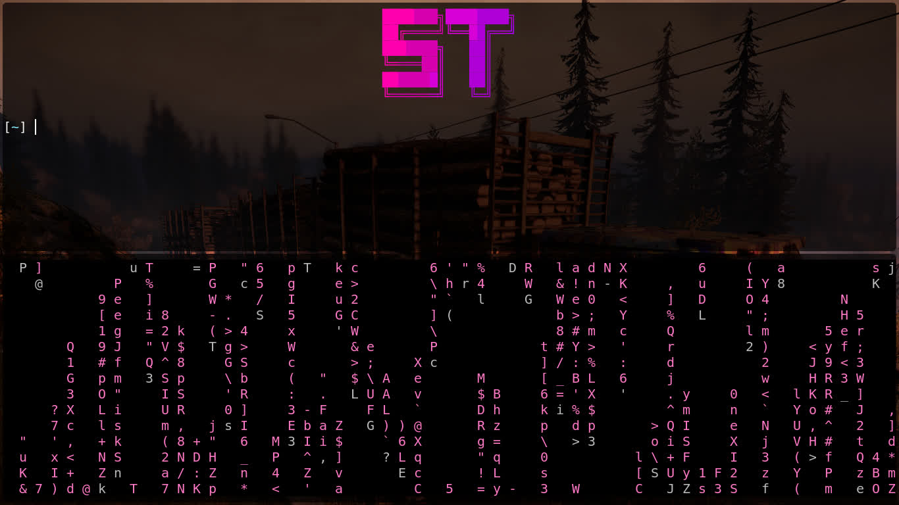

# ST

### This is a fork of the suckless simple terminal (ST), with additional fixes for mouse and Emoji compatibility.

# ALPHA_B build of ST - the simple (suckless) terminal



The [suckless terminal (st)](https://st.suckless.org/) with some additional
features that make it literally the best terminal emulator in the Void:

## Unique features:

+ **follow urls** by pressing `logokey-l`
+ **copy urls** just selected with the mouse cursor.

## Bindings for:

+ Zooming out or in or reset `TERMMOD+Up/TERMMOD+Down/TERMMOD+Left/TERMMOD+J/TERMMOD+K/TERMMOD+R`
+ FullScreen can be used with `logo+f`
+ Scrolling is easy with the mouse wheel or touchpad or using the keyboard `ControlMask+Up/ControlMask+Down` you can also use pageUp and pageDown with the ControlMask.

## Pretty stuff:

+ Default color is Dracula.
+ Transparency/alpha.
+ Default font is system "mono" at 18pt, and emoji suport

## Other st patches:
+ [Alpha](https://st.suckless.org/patches/alpha/)
+ [Boxdraw](https://st.suckless.org/patches/boxdraw/)
+ [Ligatures](https://st.suckless.org/patches/ligatures/)
+ [Font2](https://st.suckless.org/patches/font2/)
+ [Scroll](https://st.suckless.org/patches/scrollback/)
+ [Clipboard](https://st.suckless.org/patches/clipboard/)
+ [Glyphs](https://st.suckless.org/patches/glyph_wide_support/)

## Installation:

You should have xlib header and harfbuzz-devel files and noto-fonts-emoji installed.

```
git clone https://github.com/elbachir-one/st
cd st
make
sudo make install
```

`make` and `fontconfig` is required to build this.

## Dependences:

### Void Linux:

```
sudo xbps-install -S xorg base-devel libXft-devel libX11-devel libXinerama-devel
harfbuzz-devel noto-fonts-emoji xclip
```

### Arch Linux:

```
sudo pacman -Sy xorg base-devel noto-fonts-emoji harfbuzz xclip
```

### Debian/Ubuntu:

```
sudo apt install build-essential libx11-dev libxinerama-dev suckless-tools libxft-dev
```

### FreeBSD:

```
doas pkg install pkgconfig ncurses noto-fonts-emoji terminfo-db
```

### OpenBSD:

```
doas pkg_add pkgocnfig ncurses terminfo-db noto-fonts-emoji
```

On OpenBSD, be sure to edit `config.mk` first and remove `-lrt` from the
`$LIBS` before compiling.

Be sure that you have a compositer like Picom or Compton running if you
want transparency.
